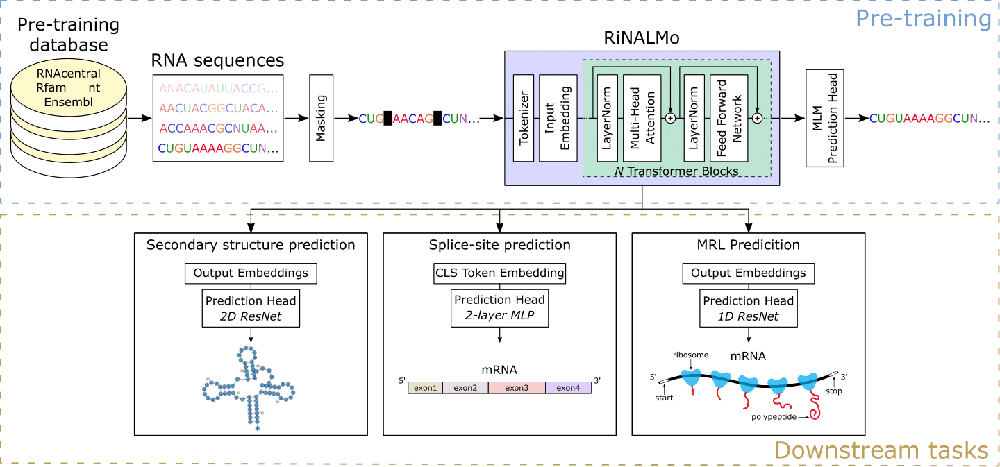

# RiboNucleic Acid Language Model - RiNALMo

### [Paper](https://arxiv.org/abs/2106.00404) | [Data]()

[Rafael Josip Penić](https://www.fer.unizg.hr/en/rafael_josip.penic)<sup>1</sup>,
[Tin Vlašić](https://sites.google.com/view/tinvlasic)<sup>2</sup>,
[Roland G. Huber](https://web.bii.a-star.edu.sg/~rghuber/index.html)<sup>3</sup>,
[Yue Wan](https://www.a-star.edu.sg/gis/our-people/faculty-staff/members/yue-wan)<sup>2</sup>,
[Mile Šikić](https://www.a-star.edu.sg/gis/our-people/faculty-staff/members/mile-sikic)<sup>2</sup>
<br>
<sup>1</sup>Faculty of Electrical Engineering and Computing, University of Zagreb, Croatia <br>
<sup>2</sup>Genome Institute of Singapore (GIS), Agency for Science, Technology and Research (A\*STAR), Singapore <br>
<sup>3</sup>Bioinformatics Institute (BII), Agency for Science, Technology and Research (A\*STAR), Singapore

This is the official implementation of the paper "RiNALMo: General-Purpose RNA Language Models Can Generalize Well on Structure Prediction Tasks".

Pretrained and fine-tuned model weights can be found [here](https://zenodo.org/records/10725749).

## About
Ribonucleic acid (RNA) plays a variety of crucial roles in fundamental biological processes. Recently, RNA has become an interesting drug target, emphasizing the need to improve our understanding of its structures and functions. Over the years, sequencing technologies have produced an enormous amount of unlabeled RNA data, which hides important knowledge and potential. Motivated by the successes of protein language models, we introduce RiboNucleic Acid Language Model (RiNALMo) to help unveil the hidden code of RNA. RiNALMo is the largest RNA language model to date with 650 million parameters pre-trained on 36 million non-coding RNA sequences from several available databases. RiNALMo is able to extract hidden knowledge and capture the underlying structure information implicitly embedded within the RNA sequences. RiNALMo achieves state-of-the-art results on several downstream tasks. Notably, we show that its generalization capabilities can overcome the inability of other deep learning methods for secondary structure prediction to generalize on unseen RNA families.

 

## Quick Start
Use following commands for the installation (Prerequisites: ```Python>=3.8``` and ```CUDA>=11.8```):
```bash
git clone https://github.com/lbcb-sci/RiNALMo
cd RiNALMo
pip install .
pip install flash-attn==2.3.2
```

After installation you can easily use RiNALMo to obtain nucleotide representations:
```python
import torch
from rinalmo.pretrained import get_pretrained_model

DEVICE = "cuda:0"

model, alphabet = get_pretrained_model(model_name="giga-v1")
model = model.to(device=DEVICE)
seqs = ["ACUUUGGCCA", "CCCGGU"]

tokens = torch.tensor(alphabet.batch_tokenize(seqs), dtype=torch.int64, device=DEVICE)
with torch.no_grad(), torch.cuda.amp.autocast():
  outputs = model(tokens)

print(outputs["representation"])
```

## Installation
1. Clone the repo.
```bash
git clone https://github.com/lbcb-sci/RiNALMo
cd RiNALMo
```
2. Create conda environment. All external dependencies should be contained in ```environment.yml```.
```bash
# create conda environment for RiNALMo
conda env create -f environment.yml

# activate RiNALMo environment
conda activate rinalmo
```
3. Download pre-trained weights.
```bash
mkdir weights
cd weights
wget https://zenodo.org/records/10725749/files/rinalmo_giga_pretrained.pt?download=1
```   
4. Download fine-tuned weights.
```bash
# Download fine-tuned weights for secondary structure prediction.
wget https://zenodo.org/records/10725749/files/rinalmo_giga_ss_archiveII-16s_ft.pt?download=1
wget https://zenodo.org/records/10725749/files/rinalmo_giga_ss_archiveII-23s_ft.pt?download=1
wget https://zenodo.org/records/10725749/files/rinalmo_giga_ss_archiveII-5s_ft.pt?download=1
wget https://zenodo.org/records/10725749/files/rinalmo_giga_ss_archiveII-srp_ft.pt?download=1
wget https://zenodo.org/records/10725749/files/rinalmo_giga_ss_archiveII-grp1_ft.pt?download=1
wget https://zenodo.org/records/10725749/files/rinalmo_giga_ss_archiveII-telomerase_ft.pt?download=1
wget https://zenodo.org/records/10725749/files/rinalmo_giga_ss_archiveII-tmRNA_ft.pt?download=1
wget https://zenodo.org/records/10725749/files/rinalmo_giga_ss_archiveII-tRNA_ft.pt?download=1
wget https://zenodo.org/records/10725749/files/rinalmo_giga_ss_archiveII-RNaseP_ft.pt?download=1
wget https://zenodo.org/records/10725749/files/rinalmo_giga_ss_bprna_ft.pt?download=1

# Download fine-tuned weights for splice-site prediction.
wget https://zenodo.org/records/10725749/files/rinalmo_giga_splice_acceptor_ft.pt?download=1
wget https://zenodo.org/records/10725749/files/rinalmo_giga_splice_donor_ft.pt?download=1

# Download fine-tuned weights for mean ribosome loading prediction.
wget https://zenodo.org/records/10725749/files/rinalmo_giga_mrl_ft.pt?download=1
``` 

## Usage
### Inference

#### Example

### Fine-tuning

#### Example


## License
This code is licensed under the MIT license found in the [LICENSE](./LICENSE) file
in the root directory of this source tree.

## Citation
If you find our work useful in your research, please cite:
```bibtex
@article{
  title={RiNALMo: General-Purpose RNA Language Models Can Generalize Well on Structure Prediction Tasks},
  author={Penić, Rafael Josip and Vlašić, Tin and Huber, Roland G. and Wan, Yue and Šikić, Mile},
  journal={arXiv preprint arXiv:},
  year={2024}
}
```

## Contact
If you have any questions, please feel free to email the authors.

## Acknowledgment
This work was supported in part by the National Research Foundation (NRF) Competitive Research Programme (CRP) under Project _Identifying Functional RNA Tertiary Structures in Dengue Virus_ (NRF-CRP27-2021RS-0001) and in part by the A\*STAR under Grant _GAP2: A\*STAR RNA-Foundation Model (A\*STAR RNA-FM)_ (I23D1AG079).

The computational work for the paper was partially performed on resources of the National Supercomputing Centre, Singapore [https://www.nscc.sg](https://www.nscc.sg).
